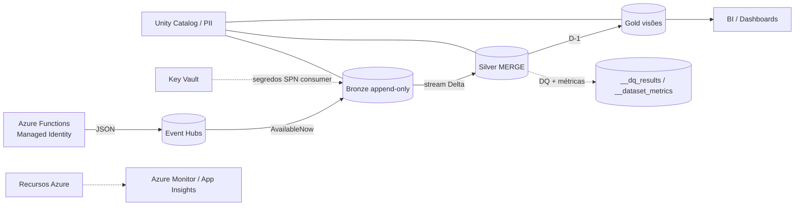

# Data Master — Plataforma de Dados de Call Center na Azure

> Plataforma de engenharia de dados **end-to-end**, orientada a eventos e baseada em
> **serviços gerenciados e elásticos** da **Microsoft Azure**, com arquitetura
> **Medallion** em **Azure Databricks**. Domínio: **call center / URA**.

<p align="center">
  
</p>

---

## Objetivo

Demonstrar, com um domínio realista, uma solução de dados que cobre todo o ciclo:

- **Ingestão em tempo real** com Azure Functions (**Managed Identity** → *Data Sender*) → **Event Hubs**
- **Processamento incremental** em camadas `bronze → silver → gold` com **streaming
  Delta + MERGE idempotente**
- **Confiabilidade de dados** com **data contracts + quarentena (DLQ)** e
  **observabilidade** de volume/freshness, além de Data Quality por regra
- **Governança e PII** com **Unity Catalog** (column masking) e RBAC *least privilege*
- **Observabilidade** com Azure Monitor + alertas como código
- **FinOps** com Azure Cost Management
- **Automação**: IaC modular (**Bicep**), **Databricks Asset Bundles**, **CLI `dm`**,
  **CI/CD** (lint + testes + validação de bundles) e **testes** (pytest)

## Arquitetura em uma olhada


```mermaid
flowchart LR
    FN[Azure Functions<br/>Managed Identity] -->|JSON| EH[(Event Hubs)]
    EH -->|AvailableNow| B[(Bronze append-only)]
    B -->|stream Delta| S[(Silver MERGE)]
    S -->|D-1| G[(Gold visões)]
    G --> BI[BI / Dashboards]
    KV[Key Vault] -.->|segredos SPN consumer| B
    UC[Unity Catalog / PII] --- B & S & G
    S -.->|DQ + métricas| DM[(__dq_results / __dataset_metrics)]
    INFRA[Recursos Azure] -.-> MON[Azure Monitor / App Insights]
```

## Documentação

A documentação completa está em [`docs/`](./docs).

1. [Apresentação do Case](docs/overview.md)
2. [Modelo de Dados (MER)](docs/mer.md)
3. [Camadas do Data Lake (Medallion)](docs/layers.md)
4. [Visão Geral da Arquitetura](docs/architecture.md)
5. [Componentização da Arquitetura](docs/stacks.md)
6. [Trade-offs e Decisões](docs/trade-offs.md)
7. [Pré-Requisitos](docs/pre-requirements.md)
8. [Instalação da CLI `dm`](docs/installation.md)
9. [Utilização (do zero ao dashboard)](docs/how-to-use.md)
10. [Ingestão de Dados (Bronze)](docs/ingestion.md)
11. [Processamento de Dados (Silver)](docs/processing.md)
12. [Geração de Dados Analíticos (Gold)](docs/analytics.md)
13. [DataViz e Observabilidade](docs/observability.md)
14. [Governança e Segurança](docs/governance.md)
15. [FinOps — Custos](docs/finops.md)
16. [Benchmark e Performance](docs/benchmark.md)
17. [Roadmap Técnico](docs/roadmap.md)
18. [Referência Técnica](docs/reference.md)
19. [Considerações Finais](docs/considerations.md)

Complementos: [ADRs](docs/adrs) · [Runbooks](docs/runbooks) · [Relatório do case](report/report.md)

## Estrutura do repositório

```
├── cli/             # CLI `dm` (Typer) — provision / deploy / run / validate
├── database/        # DDL (migrations) + MER (mermaid)
├── Databricks/
│   ├── essential/   # setup do Unity Catalog + schemas + governança de PII
│   ├── layer_*/     # Asset Bundles + notebooks (bronze/silver/gold)
│   ├── orchestration/  # job dm-pipeline (encadeia as camadas por dependência)
│   └── lib/         # transforms · quality · security (compartilhado e TESTADO)
├── docs/            # documentação (+ adrs, runbooks)
├── function_app/    # produtor de eventos (Azure Functions)
├── infrastructure/  # Bicep modular (inclui observabilidade: Monitor + alertas + workbook)
└── tests/           # pytest (unit) — geradores, transforms, PII, CLI
```

## Quickstart

```bash
# 0) Dependências de dev + testes
pip install -r tests/requirements-dev.txt && pytest -q

# 1) Infra (Bicep modular) + SPN consumidora/segredos
pip install -e cli/
dm provision -g rsgcjtecprd001          # Bicep: recursos + RBAC + app settings
dm setup-spn -g rsgcjtecprd001          # SPN consumidora + segredos (o que o Bicep não faz)

# 2) Deploy dos jobs e execução do pipeline
dm deploy all                            # essential → bronze → silver → gold → orchestration
dm run dm-pipeline -l orchestration
```

Veja o passo a passo detalhado em [Utilização](docs/how-to-use.md).

## Qualidade de engenharia

- ✅ **Testes** unitários (pytest) + **integração** (streaming/checkpoint/MERGE com Spark) no CI
- ✅ **Lint** (ruff), **security scan** (bandit/pip-audit) e **validação de bundles/Bicep** no CI
- ✅ **Código compartilhado** e sem duplicação (`Databricks/lib`)
- ✅ **IaC modular** e idempotente (Bicep) com RBAC *least privilege*
- ✅ **Data contracts + DLQ** e **observabilidade** de dados (volume/freshness)
- ✅ **Governança de PII** imposta no catálogo (não só no pipeline)

---

<sub>Stack: Azure Functions · Event Hubs · Databricks · Delta Lake · Unity Catalog ·
ADLS Gen2 · Key Vault · Azure Monitor · Bicep · Python.</sub>
