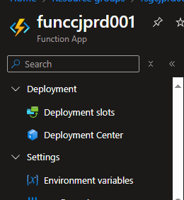

# Azure Data Pipeline Demonstration

## I. Resumo
Este projeto visa demonstrar a criação de uma pipeline completa de processamento de dados utilizando diversas ferramentas da Microsoft Azure. Inicialmente, o **Azure Functions** é configurado para consumir dados de uma API externa, utilizando uma **Service Principal Name (SPN)** para autenticação segura. Esses dados são enviados para o **Event Hub**, que atua como um hub central para ingestão de dados em tempo real. Posteriormente, o **Databricks** é utilizado para processar esses dados com **Spark Streaming**, configurado com a opção de **trigger once** para realizar a ingestão apenas quando novos dados estão disponíveis, economizando recursos computacionais.

No Databricks, os dados são armazenados na camada Bronze para ingestão bruta, passam por um processo de tratamento e normalização na camada Silver e, finalmente, são agregados na camada Gold. A camada Gold é utilizada para consolidar informações importantes que podem ser visualizadas em ferramentas de Business Intelligence (BI).

Além disso, o projeto demonstra a otimização de recursos ao utilizar o Schema Registry. 
Foram configuradas duas instâncias no EventHub:
- Instância A (com Schema Registry): Utiliza o Schema Registry para validar e padronizar os dados antes de serem enviados.
- Instância B (sem Schema Registry): Não utiliza o Schema Registry, permitindo comparar a eficiência e os recursos consumidos em ambas as instâncias.

É importante destacar que os dados utilizados são fictícios e servem exclusivamente para fins demonstrativos, evidenciando a funcionalidade e a integração das diferentes ferramentas.

## II. Objetivo
O objetivo principal deste projeto é ilustrar como integrar e utilizar o Azure Functions, Event Hub e Databricks para criar uma solução eficiente de processamento e análise de dados. 
 A partir desta demonstração, pretende-se mostrar:
<li>Como o Azure Functions pode ser utilizado para consumir dados de APIs externas de forma segura.
<li>A eficiência do Event Hub como ponto central de ingestão de dados em tempo real.
<li>O uso do Databricks para processar dados com Spark Streaming, otimizando a ingestão de dados com a opção de trigger once.
<li>O fluxo de dados desde a camada Bronze até a camada Gold, incluindo ingestão bruta, tratamento e normalização, e agregação de informações.
<li>A comparação entre o uso e não uso do Schema Registry no EventHub, evidenciando como ele otimiza o recurso.

Esse case foi desenvolvido com o intuito de proporcionar um entendimento claro e prático de como essas ferramentas podem ser usadas em conjunto para resolver problemas reais de processamento de dados, além de demonstrar a flexibilidade e a robustez da plataforma Azure.

## III. Explicação de como foi desenvolvido
### 1. Configuração da Infraestrutura
Para iniciar o processo, executamos o [script.sh](Infraestrutura/script.sh) disponível no repositório do Git. Este script é responsável por criar todas as infraestruturas necessárias para o projeto, incluindo recursos no Azure como EventHub, Azure Functions e Databricks.

### 2. Registro do Schema no EventHub
Em seguida, configuramos o schema registry do EventHub utilizando o arquivo [user_schema.avsc](Infraestrutura/EventHub/user_schema.avsc). Este arquivo define a estrutura dos dados que serão enviados para o EventHub e pode ser encontrado no repositório do Git. A configuração do schema registry assegura que os dados enviados estejam em conformidade com o formato esperado.

### 3. Implementação da Função no Azure Functions
Para a implementação da função no Azure Functions, utilizamos o arquivo [func_user.py](Infraestrutura/Functions/func_user.py), disponível no repositório do Git. Este arquivo contém o código em Python necessário para processar os dados e enviá-los para o EventHub. A função é implantada no Azure Functions, onde é executada em resposta a eventos, processando e transmitindo os dados de forma eficiente.

### 4. Envio de Dados utilizando SPN
A função Python implementada no Azure Functions utiliza uma Service Principal Name (SPN) para autenticação segura e envio dos dados ao EventHub. A SPN garante que a comunicação entre os serviços seja segura e confiável.

### 5. Integração com Databricks
No Databricks, utilizamos outra SPN para autenticação e busca dos dados enviados para o EventHub. Este processo é realizado utilizando o Spark Streaming, que consome os dados do EventHub em tempo real.

### 6. Arquitetura Medallion no Databricks
A arquitetura Medallion é implementada no Databricks para organizar e processar os dados em camadas, visando melhorar a qualidade e a acessibilidade dos dados. Este processo é dividido em três camadas principais:

#### Camada Bronze
Utilizando o Spark Streaming, os dados brutos são consumidos do EventHub e armazenados na camada Bronze. Esta camada contém os dados em seu formato original, conforme recebidos do EventHub.

#### Camada Silver
Em seguida, os dados são processados em lote (batch) utilizando Spark. Durante este processo, realizamos a normalização e limpeza dos dados. Os dados tratados são armazenados na camada Silver, que apresenta um formato mais estruturado e pronto para análises.

#### Camada Gold
Finalmente, os dados são transformados e agregados na camada Gold. Esta camada contém dados altamente estruturados e otimizados para análise de negócios e geração de relatórios. A camada Gold oferece a melhor qualidade de dados, pronta para consumo por ferramentas de BI e análises avançadas.

## IV. Passo a passo para a implementação

### 1. Criando todos os recursos
Passos para executar o script:
  1. Faça o upload do arquivo para o Cloud Shell.
  2. Conceda permissão de execução ao script com o comando: `chmod +x script.sh`
  3. Execute o script, passando o caminho onde ele se encontra: `./script.sh`

  
   
  <em>Figura 1: Importar o arquivo SCRIPT.SH para criar recursos e permissões </em>

Feito isso já podemos ver os recursos criados dentro do *resource group*

### 2. Criar o Schema no EventHub
Passos para a criação do *schema* dentro do *schema group*:
  1. Dentro do recurso do Event Hub, procure por Schema Registry.
  2. No Schema Registry, você verá um Schema Group criado. Clique para acessá-lo.
  3. Clique na opção `+ Schema` depois coloque o nome e importe o arquivo `user_schema.avsc` mencionado acima.

  
  
  

Após criar o schema, copie o **ID** do schema gerado. Este ID será utilizado na configuração da função no Azure Functions.

### 3. Configuração da Variável de Ambiente no Azure Functions
Para que a função no Azure Functions possa acessar o schema criado, é necessário configurar o ID do schema como uma variável de ambiente. 
Passos para configurar a variável de ambiente:
  1. Acesse o recurso do Azure Functions no portal do Azure.
  2. Vá para Configurações e clique em Configurações da aplicação.
  3. Adicione uma nova configuração de aplicação com o nome SCHEMA_USER_ID e cole o ID do schema copiado anteriormente como valor.

Salve as alterações.

### 4. Realizando o deploy da Função no Azure Functions
Passos para a implementação:
  1. Faça o upload do arquivo func_user.py para o Azure Functions.
  2. Certifique-se de que a variável de ambiente SCHEMA_USER_ID está configurada corretamente, conforme descrito acima.
  3. Execute a função para verificar se os dados estão sendo processados e enviados corretamente para o EventHub.
