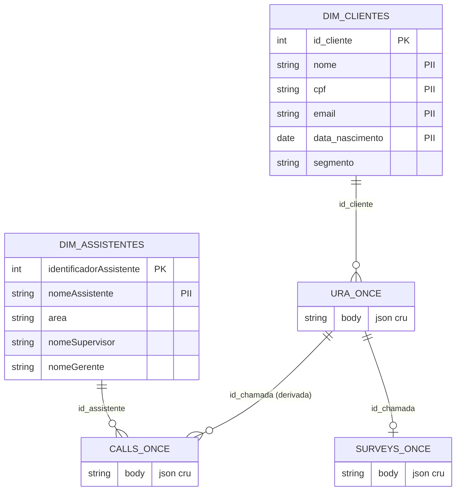
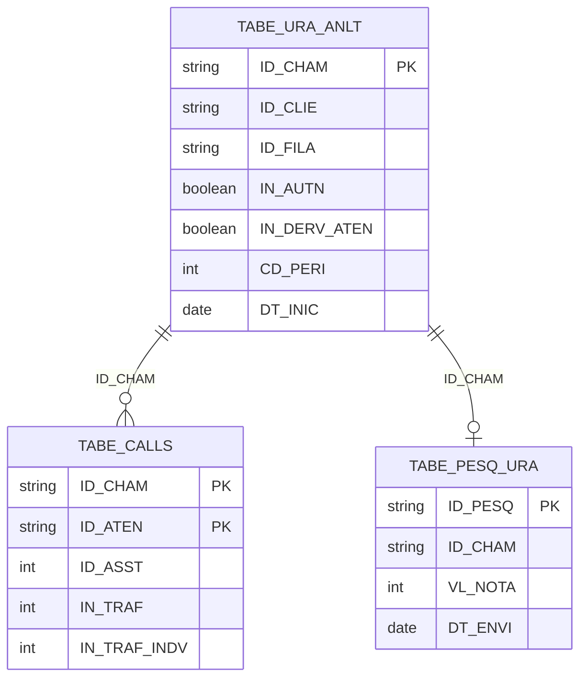

# Modelo de Entidade-Relacionamento (MER)

Modelo lógico do domínio **call center**, organizado pela arquitetura Medallion.
Diagramas em Mermaid (renderizam no GitHub). O DDL físico está em [`../ddl`](../ddl).

## Visão de negócio

Uma **chamada** chega à **URA** (autoatendimento). Se o cliente é **derivado**,
gera um ou mais **atendimentos humanos** (por um **assistente**) e, eventualmente,
responde a uma **pesquisa de satisfação**. Clientes e assistentes são dimensões.

## Bronze (núcleo cru)

## Silver (normalizada)

## Gold (visões analíticas)

| Tabela | Grão | Origem |
|---|---|---|
| `visao_ura_calls` | dia × fila | `tabe_ura_anlt` + `tabe_calls` |
| `visao_assistentes` | dia × assistente | `tabe_calls` + `tabe_pesq_ura` + `dim_assistentes` |

> A coluna `CD_PERI` (yyyyMM) e a data de referência (`DT_INIC`/`DT_REFE`) são as
> chaves de particionamento lógico (liquid clustering) em todas as camadas.
