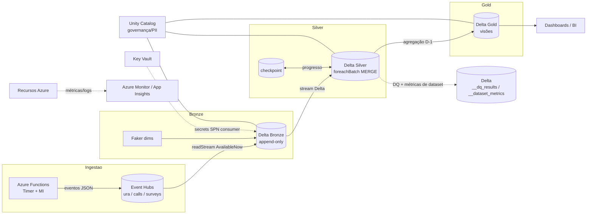
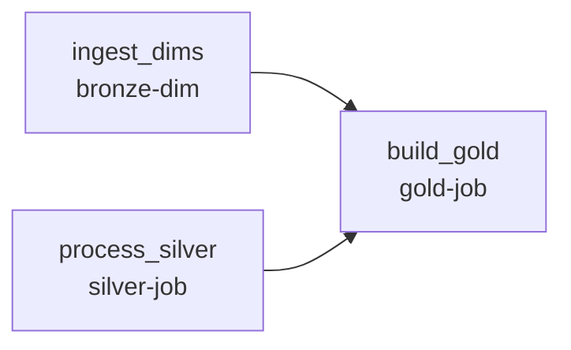

# 04. Visão Geral da Arquitetura

A arquitetura é **orientada a eventos**, **serverless** onde possível, e
**modular** — cada componente é provisionado por um módulo Bicep isolado (ver
[Componentização](stacks.md)) e cada camada de processamento é um Databricks Asset
Bundle independente.

  

## Fluxo end-to-end

## 1. Ingestão (produção de eventos)

Uma **Azure Function** com **TimerTrigger** gera eventos sintéticos coerentes —
URA, derivações e pesquisas mantêm o mesmo `id_chamada` — e os envia para três
**Event Hubs** distintos. A autenticação usa a **Managed Identity** do Function App
(papel *Azure Event Hubs Data Sender*): envio por OAuth, sem SAS keys e sem segredo em
configuração ou no Key Vault. Detalhes em [Ingestão](ingestion.md).

## 2. Bronze (landing)

Um job Databricks (**`Trigger.AvailableNow`**) consome cada Event Hub e grava na Bronze em
**Delta**. As dimensões são geradas em paralelo. A Bronze é **imutável / append-only**:
nenhuma transformação de negócio acontece aqui.

## 3. Silver (Bronze → Silver)

Job diário que consome a Bronze (append-only) como **stream Delta + checkpoint**
(`AvailableNow`), faz o parse do JSON cru, normaliza nomes e tipos, deriva colunas de
data e aplica **MERGE idempotente** via `foreachBatch`. Ver [Processamento](processing.md).

## 4. Gold (Silver → Gold)

Job diário que cruza as tabelas Silver com as dimensões e materializa as **visões
analíticas D-1** (`visao_ura_calls`, `visao_assistentes`), com `replaceWhere` por
data de referência. Ver [Geração de Dados Analíticos](analytics.md).

## Orquestração

O pipeline diário é orquestrado **por dependência** (não por horário): o bundle
`orchestration` define o job `dm-pipeline`, que encadeia as camadas com `depends_on`
disparando os jobs de cada camada via `run_job_task`.

| Job | Trigger |
|---|---|
| `dm-pipeline` (orquestrador) | agendado diariamente (único schedule do batch) |
| `bronze-dim`, `silver-job`, `gold-job` | sem schedule próprio — disparados pela cadeia |
| `bronze-streaming` | schedule próprio (a cada 30 min) — ingestão contínua |

> `gold` só inicia quando **dims** e **silver** concluem. A ingestão de streaming
> roda de forma independente, alimentando a Bronze ao longo do dia.

## Pilares transversais

- **Governança/Segurança** — Unity Catalog + column masking de PII + RBAC ([Governança](governance.md)).
- **Observabilidade** — Azure Monitor + alertas + dashboard ([Observabilidade](observability.md)).
- **FinOps** — Azure Cost Management ([FinOps](finops.md)).

---

[← Anterior: Camadas](layers.md) | [Voltar ao índice](../README.md#documentação) | [Próximo: Componentização →](stacks.md)
