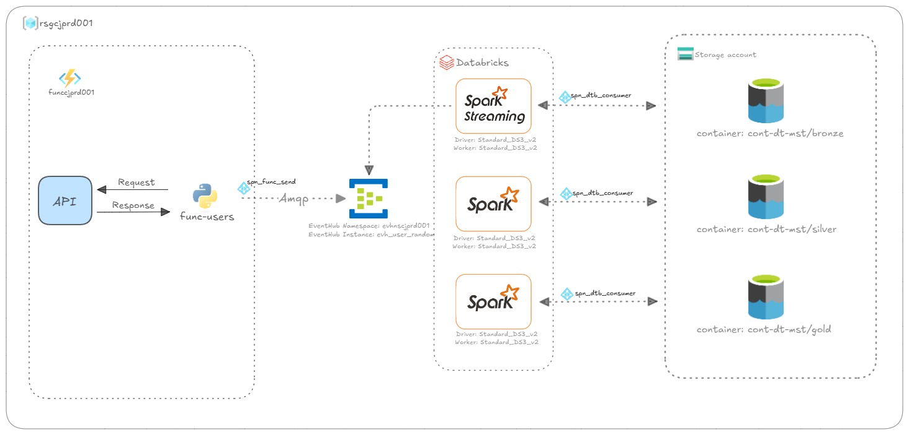
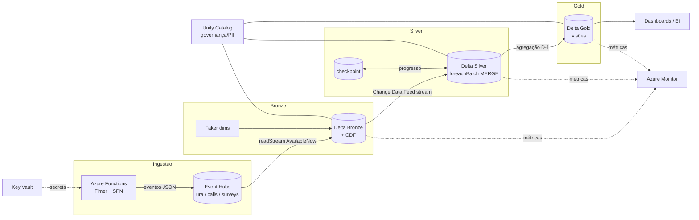

# 04. Visão Geral da Arquitetura

A arquitetura é **orientada a eventos**, **serverless** onde possível, e
**modular** — cada componente é provisionado por um módulo Bicep isolado (ver
[Componentização](stacks.md)) e cada camada de processamento é um Databricks Asset
Bundle independente.

  

## Fluxo end-to-end

## 1. Ingestão (produção de eventos)

Uma **Azure Function** com **TimerTrigger** gera eventos sintéticos coerentes —
URA, derivações e pesquisas mantêm o mesmo `id_chamada` — e os envia para três
**Event Hubs** distintos. A autenticação usa uma **Service Principal (SPN)** cujos
segredos ficam no **Key Vault**, lidos via **Managed Identity** (a Function nunca
guarda segredo em configuração). Detalhes em [Ingestão](ingestion.md).

## 2. Bronze (landing)

Um job Databricks (**`Trigger.AvailableNow`**) consome cada Event Hub e grava na Bronze em
**Delta com CDF habilitado**. As dimensões são geradas em paralelo. A Bronze é
**imutável**: nenhuma transformação de negócio acontece aqui.

## 3. Silver (Bronze → Silver)

Job diário que consome o **CDF** da Bronze por **streaming `AvailableNow` +
checkpoint**, faz o parse do JSON cru, normaliza nomes e tipos, deriva colunas de
data e aplica **MERGE idempotente** via `foreachBatch`. Ver [Processamento](processing.md).

## 4. Gold (Silver → Gold)

Job diário que cruza as tabelas Silver com as dimensões e materializa as **visões
analíticas D-1** (`visao_ura_calls`, `visao_assistentes`), com `replaceWhere` por
data de referência. Ver [Geração de Dados Analíticos](analytics.md).

## Orquestração e agendamento

Os jobs são agendados em cascata (Quartz cron, fuso `America/Sao_Paulo`):

| Camada | Job | Agendamento |
|---|---|---|
| Bronze (dims) | `bronze-dim` | 02:00 diário |
| Bronze (streaming) | `bronze-streaming` | a cada 30 min |
| Silver | `silver-job` | 05:00 diário |
| Gold | `gold-job` | 06:00 diário |

> A janela bronze→silver→gold (02h → 05h → 06h) dá folga para a ingestão noturna
> concluir antes do processamento. Alternativas (gatilho por arquivo/evento) estão
> discutidas em [Trade-offs](trade-offs.md) e no [Roadmap](roadmap.md).

## Pilares transversais

- **Governança/Segurança** — Unity Catalog + column masking de PII + RBAC ([Governança](governance.md)).
- **Observabilidade** — Azure Monitor + alertas + dashboard ([Observabilidade](observability.md)).
- **FinOps** — Azure Cost Management ([FinOps](finops.md)).

---

[← Anterior: Camadas](layers.md) | [Voltar ao índice](../README.md#documentação) | [Próximo: Componentização →](stacks.md)
